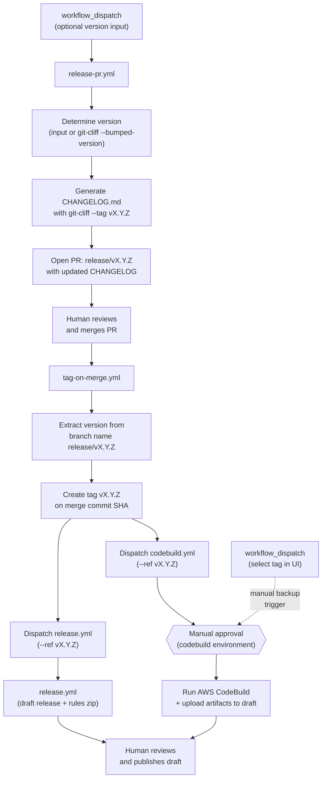
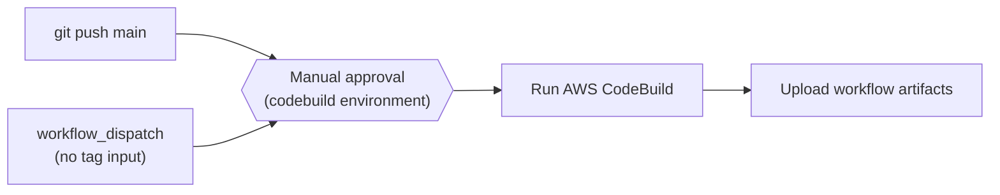

# Administrative Guide

This guide documents the CI/CD infrastructure, GitHub Workflows, protected environments, secrets, variables, permissions, and release process for the `awslabs/aidlc-workflows` repository.

**Audience:** Repository administrators, maintainers, and AI coding agents working on this repository.

**Related documentation:**
- [Developer's Guide](DEVELOPERS_GUIDE.md) — Running builds locally (CodeBuild + `act`)
- [Contributing Guidelines](../CONTRIBUTING.md) — Contribution process and conventions
- [README](../README.md) — User-facing setup and usage

---

## Table of Contents

- [Repository Overview](#repository-overview)
- [CI/CD Architecture](#cicd-architecture)
- [Workflow Reference](#workflow-reference)
  - [Release PR Workflow](#release-pr-workflow-release-pryml)
  - [Tag Release Workflow](#tag-release-workflow-tag-on-mergeyml)
  - [CodeBuild Workflow](#codebuild-workflow-codebuildyml)
  - [Release Workflow](#release-workflow-releaseyml)
- [Protected Environments](#protected-environments)
- [Secrets and Variables](#secrets-and-variables)
- [Permissions Model](#permissions-model)
- [Security Posture](#security-posture)
- [Code Ownership](#code-ownership)
- [Release Process](#release-process)
- [Changelog Configuration](#changelog-configuration)

---

## Repository Overview

This repository publishes the **AI-DLC (AI-Driven Development Life Cycle)** methodology as a set of markdown rule files under `aidlc-rules/`. The CI/CD infrastructure handles:

- **Continuous integration** via AWS CodeBuild (evaluation and reporting)
- **Release distribution** via GitHub Releases (zipped rule files)
- **Changelog generation** via git-cliff (changelog-first: updated before release, included in the tagged commit)

```
awslabs/aidlc-workflows/
├── .github/
│   ├── CODEOWNERS
│   ├── ISSUE_TEMPLATE/           # Bug, feature, RFC, docs templates
│   └── workflows/
│       ├── codebuild.yml         # CI via AWS CodeBuild
│       ├── release.yml           # GitHub Release on tag push
│       ├── release-pr.yml        # Changelog PR before release
│       └── tag-on-merge.yml      # Auto-tag on release PR merge
├── aidlc-rules/                  # The distributable product
│   ├── aws-aidlc-rules/          # Core workflow rules
│   └── aws-aidlc-rule-details/   # Detailed rules by phase
├── cliff.toml                    # git-cliff changelog configuration
├── docs/
│   ├── ADMINISTRATIVE_GUIDE.md   # This file
│   └── DEVELOPERS_GUIDE.md       # Local build instructions
└── scripts/
    └── aidlc-evaluator/          # Evaluation framework (in development)
```

---

## CI/CD Architecture

Four workflows form two distinct pipelines:

### Pipeline 1: Release (changelog-first)



The release flow is **changelog-first**: the CHANGELOG is updated *before* the tag is created, so the tagged commit always contains its own changelog entry. The flow has three human touchpoints:

1. **Merge the release PR** — reviews the changelog, triggers automatic tagging
2. **Approve the CodeBuild environment** — gates access to AWS credentials for the build
3. **Publish the draft release** — reviews artifacts, makes the release public

`tag-on-merge.yml` explicitly dispatches `release.yml` and `codebuild.yml` via `gh workflow run --ref vX.Y.Z` after creating the tag. This is necessary because tags created with `GITHUB_TOKEN` do not trigger `on: push: tags` events — but `workflow_dispatch` is exempt from this limitation. Both workflows also retain `push: tags: v*` as a fallback for manual tag pushes. The `codebuild.yml` workflow requires **manual approval** via the `codebuild` protected environment before the build proceeds. The upload step handles all release states resiliently:
- **Draft exists** (normal case) — `release.yml` finishes in ~30s creating the draft; CodeBuild takes minutes, so the draft is ready when artifacts are uploaded
- **No release yet** (codebuild finished first) — creates a draft with build artifacts; `release.yml` will update it later
- **Already published** (re-run) — attempts to replace artifacts, warns gracefully if immutable

**Backup strategy:** If the tag-triggered CodeBuild run fails or is blocked, an admin can manually dispatch the workflow via `workflow_dispatch` and select the `v*` tag in the GitHub UI branch/tag selector. Since `github.ref` resolves to the selected tag, the upload step activates automatically.

### Pipeline 2: Continuous Integration



---

## Workflow Reference

### Release PR Workflow (`release-pr.yml`)

| Property | Value |
|----------|-------|
| **File** | `.github/workflows/release-pr.yml` |
| **Trigger** | `workflow_dispatch` with optional `version` input |
| **Environment** | _(none)_ |
| **Runner** | `ubuntu-latest` |

**Purpose:** Generates an updated `CHANGELOG.md` from conventional commits using git-cliff and opens a PR on a `release/vX.Y.Z` branch. This is the first step in the changelog-first release flow.

**Job: `release-pr` ("Create Release PR")**

| Step | Name | Action |
|------|------|--------|
| 1 | Checkout code | `actions/checkout` with `fetch-depth: 0` (full history for git-cliff) |
| 2 | Install git-cliff | `orhun/git-cliff-action` to make the CLI available |
| 3 | Determine version | Use `inputs.version` (with semver validation) or `git-cliff --bumped-version` for auto-detection; falls back to patch bump from latest tag |
| 4 | Check tag does not exist | Fail early if the target tag already exists |
| 5 | Generate changelog | `orhun/git-cliff-action` with `--tag vX.Y.Z` to generate `CHANGELOG.md` |
| 6 | Create release PR | Commit, push `release/vX.Y.Z` branch, open PR (with label `release` if it exists in the repo) |

**Version detection:** If a version is specified, it must be valid semver (`MAJOR.MINOR.PATCH`); both `v0.2.0` and `0.2.0` are accepted. If no version is specified, `git-cliff --bumped-version` determines the next version from conventional commit prefixes. The `[bump]` config in `cliff.toml` controls the rules (e.g., `feat` → minor bump, breaking change → major bump). If no conventional commits are found, the workflow falls back to a patch bump from the latest tag. If no tags exist at all, it exits cleanly with a warning (no PR is created).

**External actions (SHA-pinned):**

| Action | Version | SHA |
|--------|---------|-----|
| `actions/checkout` | v6.0.1 | `8e8c483db84b4bee98b60c0593521ed34d9990e8` |
| `orhun/git-cliff-action` | v4.7.0 | `e16f179f0be49ecdfe63753837f20b9531642772` |

---

### Tag Release Workflow (`tag-on-merge.yml`)

| Property | Value |
|----------|-------|
| **File** | `.github/workflows/tag-on-merge.yml` |
| **Trigger** | `pull_request: types: [closed]` |
| **Condition** | PR was merged AND branch name starts with `release/v` |
| **Environment** | _(none)_ |
| **Runner** | `ubuntu-latest` |

**Purpose:** Automatically creates a version tag on the merge commit when a release PR is merged, then dispatches `release.yml` and `codebuild.yml`.

**Job: `tag` ("Create Release Tag")**

| Step | Name | Action |
|------|------|--------|
| 1 | Create tag | Extract version from branch name, verify tag doesn't exist, create via GitHub API |
| 2 | Dispatch release workflow | `gh workflow run release.yml --ref $TAG --repo $REPO` |
| 3 | Dispatch codebuild workflow | `gh workflow run codebuild.yml --ref $TAG --repo $REPO` |

**Tag creation:** Uses `gh api repos/.../git/refs` to create a lightweight tag.

**Workflow dispatch:** Tags created with `GITHUB_TOKEN` do not trigger `on: push: tags` events in other workflows. To work around this, `tag-on-merge.yml` explicitly dispatches `release.yml` and `codebuild.yml` via `gh workflow run --ref $TAG`. The `workflow_dispatch` event is exempt from this `GITHUB_TOKEN` limitation. Since `--ref` is set to the tag, both dispatched workflows see `github.ref = refs/tags/vX.Y.Z` — identical to a real tag push.

**Security:** The branch name `release/vX.Y.Z` is passed through an environment variable (not directly interpolated) to prevent command injection. The job-level `if` condition uses `github.event.pull_request.merged == true` to ensure only merged PRs trigger tagging.

---

### CodeBuild Workflow (`codebuild.yml`)

| Property | Value |
|----------|-------|
| **File** | `.github/workflows/codebuild.yml` |
| **Triggers** | `push` to `main`, `push` tags `v*`, `workflow_dispatch` (dispatched by `tag-on-merge.yml` or manual — select a tag in the UI to trigger a release build) |
| **Environment** | `codebuild` (protected, manual approval) |
| **Runner** | `ubuntu-latest` |
| **Concurrency** | Groups by `{workflow}-{ref}`, cancels in-progress |

**Purpose:** Runs an AWS CodeBuild project, downloads primary and secondary artifacts from S3, caches them in GitHub Actions cache, uploads them as workflow artifacts, and (when triggered from a `v*` tag) attaches them to the GitHub Release.

**Job: `build`**

| Step | Name | Condition | Action |
|------|------|-----------|--------|
| 1 | List caches | _(always)_ | `gh cache list` for existing project caches |
| 2 | Check cache | _(always)_ | `actions/cache/restore` with `lookup-only: true` |
| 3 | Configure AWS credentials | cache miss | `aws-actions/configure-aws-credentials` (OIDC) |
| 4 | Run CodeBuild | cache miss | `aws-actions/aws-codebuild-run-build` with inline buildspec |
| 5 | Build ID | cache miss (always) | Echo CodeBuild build ID |
| 6 | Download CodeBuild artifacts | cache miss | Download primary + secondary artifacts from S3 |
| 7 | List CodeBuild artifacts | cache miss | List and inspect downloaded zip files |
| 8 | Clean old report caches | cache miss | Delete 3 oldest matching caches for branch |
| 9 | Save report to cache | cache miss | `actions/cache/save` with key `{project}-{branch}-{sha}` |
| 10 | Upload primary artifact | `!env.ACT` | `actions/upload-artifact` for `{project}.zip` |
| 11 | Upload evaluation artifact | `!env.ACT` | `actions/upload-artifact` for `evaluation.zip` |
| 12 | Upload trend artifact | `!env.ACT` | `actions/upload-artifact` for `trend.zip` |
| 13 | Upload artifacts to release | triggered from a `v*` tag | Attach build artifacts to GitHub Release (draft or published) |

**Caching strategy:** The cache key `{project}-{branch}-{sha}` ensures that the same commit on the same branch is never built twice. On cache hit, steps 3–9 are skipped entirely.

**Inline buildspec:** The workflow embeds a full `buildspec-override` rather than referencing an external file. The buildspec:
- Installs `gh` CLI (via dnf) and `uv` (Python package manager)
- Determines build context: release (tagged), pre-release (default branch), or pre-merge (feature branch)
- Creates placeholder evaluation and trend report files under `.codebuild/`
- Outputs a primary artifact (all files under `.codebuild/`) and two secondary artifacts (`evaluation`, `trend`)

**Artifact upload compatibility:** Upload steps are gated by `!env.ACT` because `actions/upload-artifact` v6 is incompatible with the [`act`](https://github.com/nektos/act) local runner.

**External actions (all SHA-pinned):**

| Action | Version | SHA |
|--------|---------|-----|
| `actions/cache/restore` | v5.0.3 | `cdf6c1fa76f9f475f3d7449005a359c84ca0f306` |
| `aws-actions/configure-aws-credentials` | v6.0.0 | `8df5847569e6427dd6c4fb1cf565c83acfa8afa7` |
| `aws-actions/aws-codebuild-run-build` | v1.0.18 | `d8279f349f3b1b84e834c30e47c20dcb8888b7e5` |
| `actions/cache/save` | v5.0.3 | `cdf6c1fa76f9f475f3d7449005a359c84ca0f306` |
| `actions/upload-artifact` | v6.0.0 | `b7c566a772e6b6bfb58ed0dc250532a479d7789f` |

---

### Release Workflow (`release.yml`)

| Property | Value |
|----------|-------|
| **File** | `.github/workflows/release.yml` |
| **Triggers** | `workflow_dispatch` (dispatched by `tag-on-merge.yml`), `push` on tags matching `v*` (fallback for manual tag pushes) |
| **Environment** | _(none)_ |
| **Runner** | `ubuntu-latest` |

**Purpose:** Creates a **draft** GitHub Release with a zip of `aidlc-rules/` when dispatched or when a version tag is pushed. The release is kept as a draft so that CodeBuild artifacts can be attached and reviewed before publishing.

**Job: `release` ("Create Release")**

| Step | Name | Condition | Action |
|------|------|-----------|--------|
| 1 | Checkout code | _(always)_ | `actions/checkout` with `fetch-depth: 0` |
| 2 | Extract version | _(always)_ | Guard: if `GITHUB_REF` is not a `v*` tag, emit `::warning::` and skip remaining steps. Otherwise parse into `version` (no `v`) and `tag` (with `v`) |
| 3 | Create release artifact | ref is a `v*` tag | `zip -r ai-dlc-rules-v{VERSION}.zip aidlc-rules/` |
| 4 | Create GitHub Release | ref is a `v*` tag | `softprops/action-gh-release` with `draft: true` and zip attached |

**Graceful skip:** If dispatched from a branch instead of a tag (e.g., someone manually runs the workflow from `main`), the job completes successfully with a warning annotation rather than failing. This prevents confusing red X failures in the Actions UI.

**Release naming:** `AI-DLC Workflow v{VERSION}` (e.g., `AI-DLC Workflow v0.1.6`)

**External actions (SHA-pinned):**

| Action | Version | SHA |
|--------|---------|-----|
| `actions/checkout` | v6.0.1 | `8e8c483db84b4bee98b60c0593521ed34d9990e8` |
| `softprops/action-gh-release` | v2.5.0 | `a06a81a03ee405af7f2048a818ed3f03bbf83c7b` |

---

## Protected Environments

| Environment | Used By | Purpose |
|-------------|---------|---------|
| `codebuild` | `codebuild.yml` job `build` | Gates access to AWS credentials for CodeBuild |

The `codebuild` environment is the only protected environment. It contains:
- The `AWS_CODEBUILD_ROLE_ARN` secret (required for OIDC-based AWS role assumption)
- Possibly the repository variables `CODEBUILD_PROJECT_NAME`, `AWS_REGION`, and `ROLE_DURATION_SECONDS` (these may alternatively be set at the repository level)

Environment protection rules (configured in GitHub repository settings) may include required reviewers or deployment branch restrictions.

---

## Secrets and Variables

### Secrets

| Secret | Scope | Used By | Purpose |
|--------|-------|---------|---------|
| `AWS_CODEBUILD_ROLE_ARN` | Environment (`codebuild`) | `codebuild.yml` | IAM Role ARN for OIDC-based AWS STS role assumption |
| `GITHUB_TOKEN` | Automatic (GitHub-provided) | `release.yml`, `release-pr.yml`, `tag-on-merge.yml` | Authenticate GitHub API calls (release creation, PR creation, tag creation, workflow dispatch) |

The `codebuild.yml` workflow also uses `github.token` (the automatic token, accessed without the `secrets.` prefix) for cache management and release asset uploads.

### Repository Variables

| Variable | Used By | Default Fallback | Purpose |
|----------|---------|------------------|---------|
| `CODEBUILD_PROJECT_NAME` | `codebuild.yml` | `codebuild-project` | AWS CodeBuild project name |
| `AWS_REGION` | `codebuild.yml` | `us-east-1` | AWS region for CodeBuild and STS |
| `ROLE_DURATION_SECONDS` | `codebuild.yml` | `7200` | STS session duration (seconds) |

All three variables have sensible defaults via `${{ vars.VAR || 'default' }}` syntax, so the workflow runs even without explicit variable configuration.

---

## Permissions Model

### Workflow-level permissions

| Workflow | Permissions |
|----------|-------------|
| `codebuild.yml` | All 16 scopes explicitly set to `none` |
| `release.yml` | `contents: write` |
| `release-pr.yml` | `contents: write`, `pull-requests: write` |
| `tag-on-merge.yml` | `contents: write`, `actions: write` |

### Job-level permissions (overrides)

| Workflow | Job | Permissions | Rationale |
|----------|-----|-------------|-----------|
| `codebuild.yml` | `build` | `actions: write`, `contents: write`, `id-token: write` | Cache management, release asset upload, OIDC token for AWS STS |

The `codebuild.yml` workflow follows a **deny-all-then-grant** pattern: every permission scope is set to `none` at the workflow level, then only the 3 required scopes are granted at the job level. This is the strictest possible configuration and prevents privilege escalation from compromised steps.

---

## Security Posture

| Control | Implementation |
|---------|----------------|
| **Supply-chain protection** | All external actions pinned to full commit SHAs (not mutable version tags) |
| **AWS authentication** | OIDC-based role assumption via `id-token: write` — no static credentials stored |
| **Least-privilege tokens** | `codebuild.yml` explicitly denies all 16 permission scopes at workflow level, grants only 3 at job level |
| **Environment protection** | `codebuild` environment gates AWS credential access with potential reviewer/branch rules |
| **Concurrency control** | `codebuild.yml` cancels in-progress runs for the same branch |
| **Injection-safe inputs** | All user-controlled and event-driven inputs (`inputs.version`, `pull_request.head.ref`) passed via `env:` variables, never directly interpolated in `run:` blocks |
| **Code ownership** | `.github/` (including workflows) owned exclusively by `@awslabs/aidlc-admins` via CODEOWNERS |
| **Account masking** | `mask-aws-account-id: true` in AWS credential configuration |

---

## Code Ownership

Defined in `.github/CODEOWNERS`:

| Path | Owners |
|------|--------|
| `*` (default) | `@awslabs/aidlc-admins` `@awslabs/aidlc-maintainers` |
| `.github/` | `@awslabs/aidlc-admins` |
| `.github/CODEOWNERS` | `@awslabs/aidlc-admins` |
| `aidlc-rules/` | `@awslabs/aidlc-admins` `@awslabs/aidlc-maintainers` `@awslabs/aidlc-writers` |
| `assets/` | `@awslabs/aidlc-admins` `@awslabs/aidlc-maintainers` `@awslabs/aidlc-writers` |
| `scripts/` | `@awslabs/aidlc-admins` `@awslabs/aidlc-maintainers` |
| `CHANGELOG.md`, `cliff.toml`, `LICENSE`, etc. | `@awslabs/aidlc-admins` |

**Key implication:** Only `@awslabs/aidlc-admins` can approve changes to `.github/` (workflows, CODEOWNERS, issue templates).

---

## Release Process

Releases follow a **changelog-first** flow: the CHANGELOG is updated *before* the tag is created, so the tagged commit always contains its own changelog entry. The process has three human touchpoints (merge PR, approve CodeBuild, publish release).

1. **Dispatch the Release PR workflow** via the GitHub Actions UI:
   - Navigate to Actions → Release PR → Run workflow
   - Optionally specify a version (e.g., `0.2.0`); leave blank to auto-determine from conventional commits
   - `release-pr.yml` generates `CHANGELOG.md` and opens a PR on branch `release/v1.2.0` with label `release`

2. **Review and merge the release PR:**
   - Verify the changelog content is correct
   - Merge the PR (requires `@awslabs/aidlc-admins` approval since `CHANGELOG.md` is owned by them)
   - `tag-on-merge.yml` automatically creates tag `v1.2.0` on the merge commit and dispatches the release and build workflows

3. **`release.yml` runs automatically** (dispatched by `tag-on-merge.yml` with `--ref v1.2.0`):
   - Zips `aidlc-rules/` into `ai-dlc-rules-v1.2.0.zip`
   - Creates a **draft** GitHub Release named "AI-DLC Workflow v1.2.0" with the zip attached

4. **`codebuild.yml` runs automatically** (dispatched by `tag-on-merge.yml`; requires `codebuild` environment approval):
   - Runs CodeBuild on the tagged commit
   - Downloads build artifacts (primary, evaluation, trend)
   - Attaches artifacts to the draft release (or creates a draft if one doesn't exist yet)

5. **Publish the release** by clicking "Publish release" in the GitHub UI:
   - Verify all expected artifacts are attached (rules zip + build artifacts)
   - Review release notes and edit if needed

**Note:** The `codebuild` protected environment may need its deployment branch rules updated to allow `v*` tags (in addition to `main`) for tag-triggered builds to proceed.

---

## Changelog Configuration

Defined in `cliff.toml` (used by `release-pr.yml`):

| Setting | Value |
|---------|-------|
| **Commit format** | Conventional commits (`feat:`, `fix:`, `docs:`, etc.) |
| **Tag pattern** | `v[0-9].*` |
| **Sort order** | Oldest first |

**Commit groups:**

| Prefix | Group Name |
|--------|------------|
| `feat` | Features |
| `fix` | Bug Fixes |
| `doc` | Documentation |
| `perf` | Performance |
| `refactor` | Refactoring |
| `style` | Style |
| `test` | Tests |
| `ci` | CI/CD |
| `chore` | Miscellaneous |

**Filtered commits:**

| Pattern | Action |
|---------|--------|
| `docs: update changelog` | Skipped (noise from previous release flow) |

Unconventional commits are filtered out (`filter_unconventional = true`).

**Version bump rules** (defined in `[bump]` section):

| Rule | Effect |
|------|--------|
| `features_always_bump_minor = true` | `feat:` commits trigger a minor version bump |
| `breaking_always_bump_major = true` | Breaking changes trigger a major version bump |

These rules are used by `git-cliff --bumped-version` when auto-determining the next version in `release-pr.yml`.
